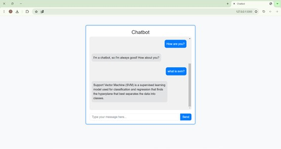

# Chatbot Project

This project is a simple chatbot web application built using Flask for the backend and Bootstrap for the frontend. The chatbot responds to predefined questions and provides helpful answers using the Levenshtein distance algorithm to find the closest matching response.

## Features

- Responds to predefined questions.
- Uses Levenshtein distance to find the closest matching response.
- Simple and clean user interface.
